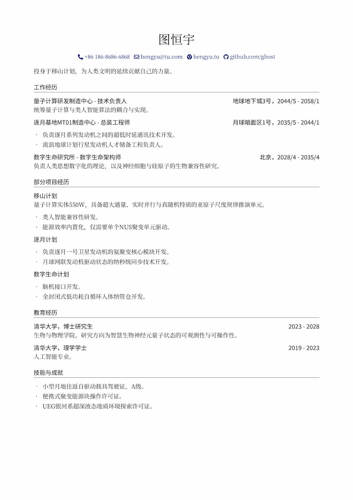

# essential-resume-tex
极简LaTex简历模板



## 特性
- 极简设计
- 样式与内容分离
- 内嵌联系方式指令，自动添加图标与URL，例如GitHub。
- 采用现代思源系列字体，支持自定义。

## 使用方式

使用前需要满足以下条件：
- 已安装XeLaTeX解决方案。本文稿基于[Tex Live](https://www.tug.org/texlive/)。
- 安装所需的思源字体。可以从[官方网站](https://fonts.google.com/noto)下载。

待上述条件满足后，克隆本项目到你的计算机：
```bash
git clone https://github.com/yinguobing/essential-resume-tex.git
```

使用任意文本编辑器编辑`main.tex`文件，替换或者填充你自己的内容。

编辑完成后保存，然后编译该文稿。

完成。

## 许可证
GNU GENERAL PUBLIC LICENSE Version 3

## 作者
尹国冰 https://github.com/yinguobing